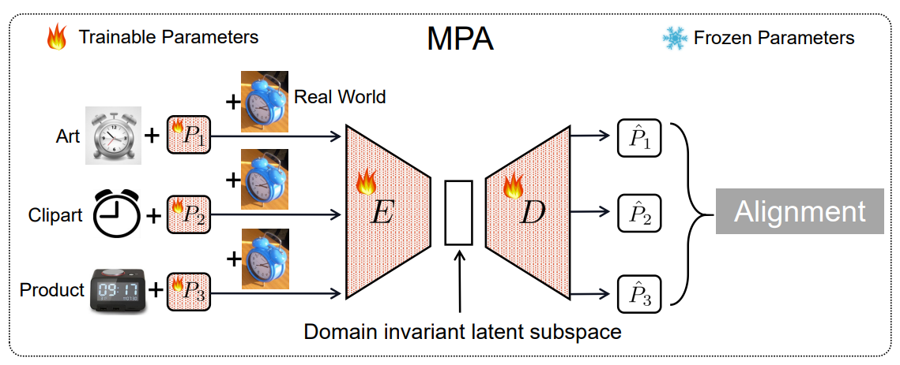

# Repository for Multi-Prompt Alignment for Multi-Source Unsupervised Domain Adaptation 

 :bookmark_tabs:[`Paper`](https://arxiv.org/pdf/2209.15210) 
 :black_nib:[`BibTex`](#black_nib-citation) 

**Authors**: Haoran Chen, Xintong Han, [Zuxuan Wu](https://zxwu.azurewebsites.net/),  Yu-Gang Jiang

## :mag: Overview
<p align="center">
  
<be>
</p>

## Contact
Feel free to contact us if you have any questions or suggestions 
Email: chenhran21@m.fudan.edu.cn

## :black_nib: Citation
If you use our code in this repo or find our work helpful, please consider giving a citation:

```
@article{chen2023mpa,
  title={Multi-prompt alignment for multi-source unsupervised domain adaptation},
  author={Chen, Haoran and Han, Xintong and Wu, Zuxuan and Jiang, Yu-Gang},
  journal={Advances in Neural Information Processing Systems},
  year={2023}
}
```
